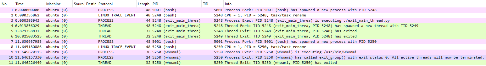
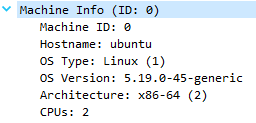
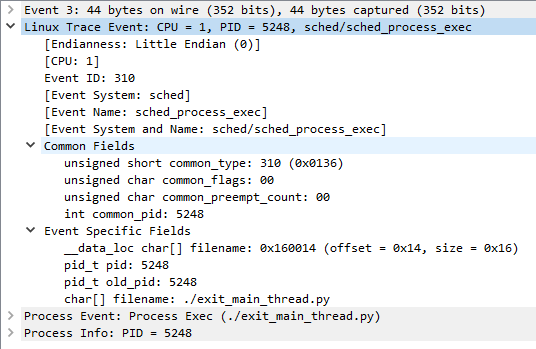
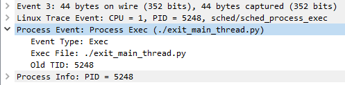
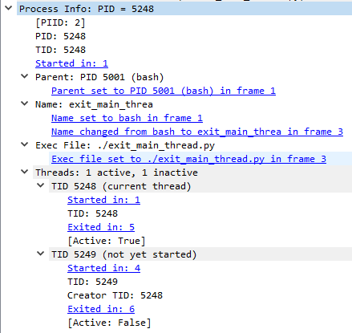

# Traceshark

Traceshark is a set of extensions for Wireshark that allows recording and analyzing system trace activity on Windows and Linux. It is essentially a multi-platform tracing framework based on Wireshark.

## Inspiration

This project was inspired by [Winshark](https://github.com/airbus-cert/Winshark) and [KernelShark](https://kernelshark.org/).

## Core features

:warning: This project is still in an early development stage, and many of the core features discussed are not implemented yet.

The following are the core features that are planned for Traceshark:

- Full backwards compatibility with Wireshark

- Support for reading common trace file formats
  
  - Uses [PcapNg](https://pcapng.com/) data structures for trivial conversion, merging and manipulation of trace files using the common PcapNg format

- Source machine tracking for trivial analysis of trace activity from multiple machines in the same file

- Dissection of common trace event formats (Linux trace events, ETW, etc.)

- Live recording of system trace activity (using ftrace on Linux and ETW on Windows)

- Common dissection format for events of interest across multiple event formats

- Activity tracking and event enrichment for important stateful operating system workflows:
  
  - Process activity tracking and enrichment of events with process context information
  
  - File operation tracking
  
  - Network operation tracking
  
  - Linking of related events using the generated context
  
  - **Requires that the capture is sorted chronologically!**

## Architecture and integration with Wireshark

Traceshark is built into the Wireshark source (there are multiple features that cannot be implemented as separate extensions using either Lua or C).

It utilizes existing components of Wireshark to achieve the desired goal:

- wiretap modules for trace file format support and integration with PcapNg

- epan extensions for tracking activity and generating context information

- Dissectors for the various event formats

- High-level generic dissectors for events of interest

- A Wireshark profile that adds some important fields to the displayed columns, and also colors events with high-level dissection

- Global trace event dissector that manages event-format-specific dissection and adds the generated context information to the dissection

- extcap modules for recording live trace activity

## Building and running

Building Traceshark is identical to [building Wireshark](https://www.wireshark.org/docs/wsdg_html_chunked/ChapterSetup.html). Note that unlike Wireshark, Traceshark requires [Glib](https://docs.gtk.org/glib/) version 2.68 or higher.

Currently only [trace-cmd](https://www.trace-cmd.org/) catpure files are supported, so the only way to test Traceshark is to [record using trace-cmd](https://man7.org/linux/man-pages/man1/trace-cmd-record.1.html) and load the file into Traceshark.

For convenience, a capture script (`tools/traceshark/traceshark-record.sh`) is provided that records only the events which have high-level dissection added to them. The script records activity from all processes and can be stopped using Ctrl+C.

## Current features

The following are the currently implemented features of Traceshark:

- Support for trace-cmd v6 capture files (padding records are not yet supported so some capture files may not be able to load)
  
  - Supports conversion of trace-cmd files to PcapNg, and all PcapNg file manipulation is supported except merging files (WIP)
  
  - Adds machine info that is stored in trace-cmd files to all trace events

- Full dissection of Linux trace events (using event formats stored in trace-cmd capture files)

- High level dissection of Linux process events
  
  - Process fork
  
  - Process exec
  
  - Process exit (exit_group events)

- Process information tracking based on the above process events

- Process context info dissection

## What's next

- Add support for merging trace files and handling the separation of source machines

- Add support for more process events (thread exit, process rename)

- Extend support for trace-cmd capture files (padding records and v7 trace files)

- Add support for [procmon](https://learn.microsoft.com/en-us/sysinternals/downloads/procmon) captures:
  
  - procmon file format
  
  - Dissection of procmon events
  
  - Process tracking for Windows

- Add support for ETW captures produced by [logman](https://learn.microsoft.com/en-us/windows-server/administration/windows-commands/logman)
  
  - logman catpure files
  
  - Dissection of ETW events

- Dissect file events and add file context

- Dissect network events and add network context
  
  - Link network trace events with classic captured packets in the same file

- Add live recording capabilities
  
  - Linux trace events (using ftrace)
  
  - ETW

## Screenshots

